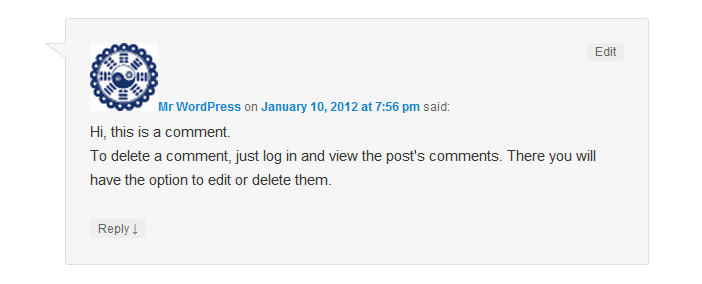

# Custom Avatars

Custom Avatars is a WordPress plugin that allows you to give visitors custom avatars for their comments if they don't have a Gravatar. This plugin enhances the visual appeal of your WordPress blog by providing a unique avatar theme for users without a Gravatar.

## Features

- Allows users to use custom random avatars instead of the default Gravatars.
- Avatars are displayed in the comments section of your WordPress blog.
- Easy installation and configuration.

## Installation

1. Download the latest release of the Custom Avatars plugin from the [Releases](https://github.com/fahdi/wp-custom-avatars/releases) page.
2. Extract the downloaded ZIP file.
3. Upload the extracted folder to the `wp-content/plugins/` directory of your WordPress installation.
4. Activate the plugin through the WordPress admin dashboard.

## Usage

1. Once the plugin is activated, it will automatically generate random avatars for users who do not have a Gravatar associated with their email address.
2. Avatars are displayed in the comments section next to the user's name.

## Compatibility

- Requires at least WordPress 3.3 or higher.
- Tested up to WordPress 6.2.2.

## Contributions

Contributions are welcome! If you have any bug reports, feature requests, or suggestions, please [create an issue](https://github.com/fahdi/wp-custom-avatars/issues) or submit a pull request.

## Credits

- Plugin developed by [iElectrify](https://ielectrify.com) and [Fahd Murtaza](https://www.fahdmurtaza.com).

## Support

If you encounter any issues or have any questions, please feel free to contact the developers at [info@fahdmurtaza.com](mailto:info@fahdmurtaza.com).

## License

The Custom Avatars plugin is licensed under the [GNU General Public License v3.0](LICENSE).
